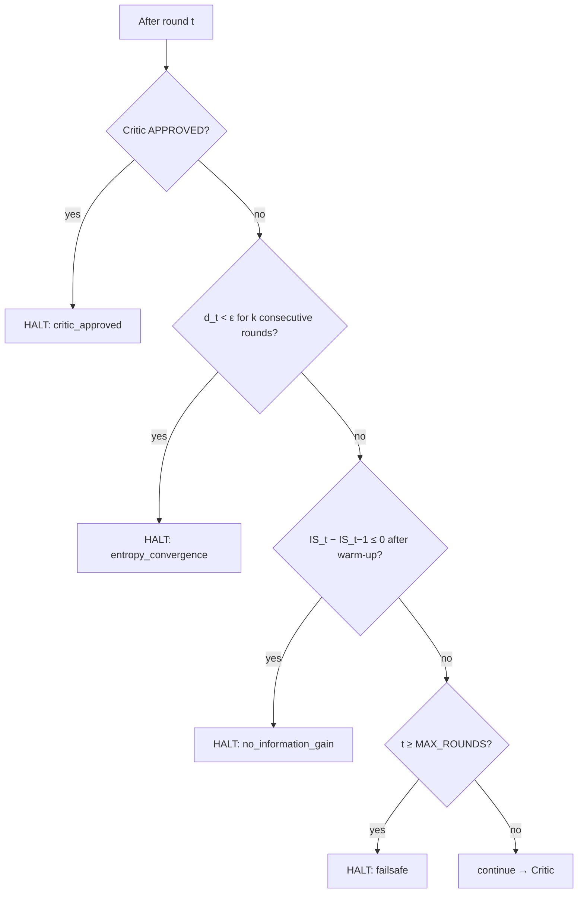
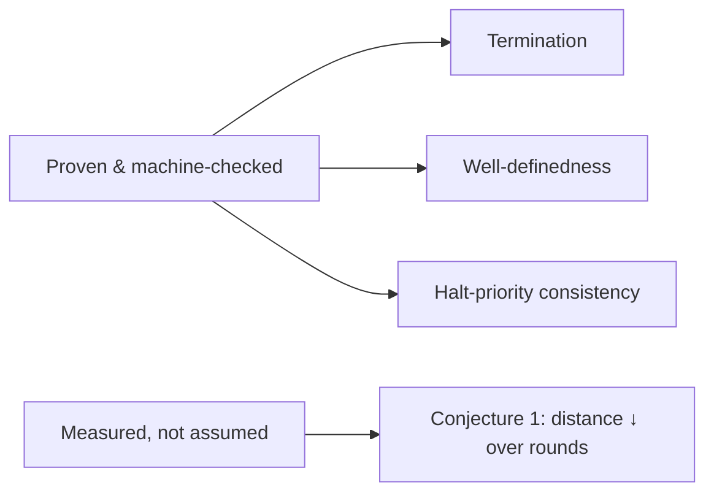
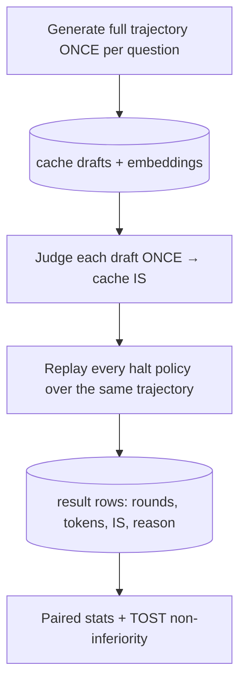

# Semantic Early-Stopping for Iterative LLM Agent Loops: A Judge-Efficient Study of *When to Halt*

**Author:** Sahil Shrivastava
**Status:** Working manuscript (draft). Theory claims are machine-checked
(`backend/shp/theory_checks.py`); empirical numbers are produced by the harness
in `backend/experiments/`. Cells marked *(pending)* are filled after the runs
complete. Preliminary dev-split observations (N=14, partial run) are included and
labelled as such.

---

## Abstract

Iterative multi-agent LLM loops — e.g. a Writer that drafts and a Critic that
revises — are typically terminated by a fixed iteration cap (`max_iterations`).
This *syntactic* kill-switch is blind to whether the answer is still improving: it
over-spends on easy inputs and truncates hard ones. We study **semantic
early-stopping**: halting when consecutive draft embeddings stop changing in
meaning (cosine-distance patience) and the answer's measured quality stops
improving. We contribute (i) an **honest theoretical footing** — a proof of
deterministic termination and well-definedness, with the convergence of the
distance sequence treated as an *empirically tested conjecture* rather than a
(previously over-claimed) Banach contraction; (ii) a **judge-efficient evaluation
protocol** — generate each trajectory once, replay all stopping policies over it,
and cache every LLM-judge call — enabling a strictly paired efficiency-vs-quality
comparison on modest compute; and (iii) an **empirical study** on multi-hop RAG QA
(HotpotQA) comparing semantic halting to the `max_iterations` baseline and to
critic-only, fixed-budget, random, and oracle policies, with paired statistics and
TOST non-inferiority testing. A preliminary dev observation: 76% of round-to-round
semantic distances already fall below the halting threshold, with a heavy tail
(max 0.30), confirming that the loop has genuine room to stop early while still
encountering rounds of substantive change.

---

## 1. Introduction

### 1.1 The problem
A widely used agentic pattern is the **Writer→Critic loop**: a Writer produces an
answer, a Critic critiques it, the Writer revises, repeat. A termination rule is
required. The default — stop after *N* rounds — is wasteful in two directions:

- **Over-iteration.** Easy questions converge in 1–2 rounds; the loop keeps
  spending tokens and latency until *N*.
- **Under-iteration.** Hard questions may need more than *N* and are cut off.

Crucially, a counter cannot perceive that rounds 4, 5 and 6 all said essentially
the same thing. The decision is made on *iteration index*, not on *content*.

### 1.2 The idea
Map each draft to an embedding and measure the **cosine distance** between
consecutive drafts. When that distance stays below a threshold ε for *k*
consecutive rounds, the answer has **converged in meaning**; further iteration is
churn. We combine this geometric signal with a **quality signal** (an Information
Score over RAG metrics) so the loop halts only when the answer has both stopped
*changing* and stopped *improving*, with critic-approval and a hard failsafe as
additional stopping conditions.

### 1.3 Contributions
1. **Honest theory** (§4): deterministic termination + well-definedness +
   halt-priority consistency are *proven and machine-checked*; semantic
   non-expansiveness is stated as a *measured conjecture*, not a theorem.
2. **Judge-efficient evaluation protocol** (§5): trajectory-replay + cached
   judging + an explicit *operational-vs-evaluation* token model, giving a fair,
   paired, low-cost comparison of halting policies.
3. **Empirical study** (§6) on HotpotQA multi-hop QA against five baselines, with
   paired significance tests and non-inferiority testing of quality.

---

## 2. Related Work and Novelty

### 2.1 Positioning
Semantic convergence and termination of agentic loops have been approached from
several angles. We summarise the closest reference works (full notes in
`preprint.md`; arXiv IDs to be verified before camera-ready):

| Work | Core idea | Relation to SHP |
|---|---|---|
| Fixed-point / transfinite semantic convergence | Theoretical fixed-point operators in embedding space | Shares the *convergence* intuition; SHP refuses the contraction *guarantee* and instead proves termination + measures convergence |
| Collaborative entropy for multi-LLM uncertainty | Cross-model semantic disagreement at one time-step | Orthogonal: SHP measures *cross-round* convergence of one loop, not cross-model spread |
| Task-adaptive orchestration | *Which* topology to use; structural termination | Orthogonal: SHP decides *when to exit* a fixed topology, by content |
| Contraction mappings for clinical attractors | Contraction in a feature manifold + LLM oracle | Same mechanism family, different domain; SHP is text/QA with quality-gating |
| Phase-scheduled token efficiency | *Which agent fires when* | Complementary: scheduling vs global termination |

### 2.2 Is this unique? Is it used elsewhere?
**Honest answer:** the *ingredients* are not all individually new — early stopping
(ML training), early-exit inference (adaptive computation in neural nets), and
embedding-based similarity are established. What is, to our knowledge, **not done
together** is:

1. **Quality-gated semantic halting for agent loops** — stopping on *meaning
   convergence AND quality plateau*, rather than convergence alone or a counter.
2. **A judge-efficient, strictly-paired evaluation protocol** that makes "which
   halt policy is best" measurable cheaply (trajectory replay + cached judging).
3. **An operational-vs-evaluation token accounting** that *charges a policy for
   its own measurement overhead* — exposing that the information-gain signal can
   cost more than it saves, and motivating a judge-free *entropy-only* variant.

Contributions (2) and (3) are reusable beyond SHP: any researcher comparing
stopping/early-exit policies for LLM loops can adopt the protocol. That
methodological reusability — not a brand-new mathematical object — is the
defensible novelty.

### 2.3 How it differs from the current scenario
Most deployed agent frameworks (LangChain/LangGraph templates, AutoGPT-style
loops) still ship a `max_iterations` integer as the only stop control. SHP
replaces that integer with a content-aware cascade and, importantly, *quantifies*
the trade-off rather than asserting it.

---

## 3. Method

### 3.1 System architecture

```mermaid
flowchart LR
    Q[Question + retrieved contexts] --> W[Writer LLM]
    W -->|draft_t| EMB[Embed draft → e_t]
    EMB --> D[Cosine distance d_t = 1 − cos&#40;e_t, e_t−1&#41;]
    W -->|draft_t| J[RAGAS judge → Information Score IS_t]
    D --> H{Halt cascade}
    J --> H
    C[Critic LLM] -->|APPROVED?| H
    H -->|continue| C
    C -->|feedback| W
    H -->|halt| OUT[Final answer + halt reason]
```



The Writer and Critic both condition on the **retrieved contexts** (a true RAG
setting). Embeddings use a frozen local model (`BAAI/bge-small-en-v1.5`), so the
convergence signal is free of API cost.

### 3.2 Signals
For drafts $x_1,\dots,x_T$ with embeddings $e_t=\phi(x_t)$:

$$ d_t = 1 - \cos(e_t, e_{t-1}) \in [0,2], \qquad
   \mathrm{IS}_t = \sum_{m\in\mathcal M} w_m \cdot \mathrm{RAGAS}_m(x_t) \in [0,1], $$

where $\mathcal M = \{\text{faithfulness, answer\_relevancy, context\_precision,
context\_recall}\}$ and weights $w$ lie on the simplex (from `optimize_score.py`:
entropy / AHP / constrained-LS / equal strategies).

### 3.3 The halt cascade



One shared implementation (`shp/halting.py`) drives the live loop, the post-hoc
reason derivation, and the offline policy replay — so they cannot disagree.

### 3.4 Algorithm (per question)
```
e_prev ← ∅;  dist_hist ← [];  is_hist ← []
for t = 1 … MAX_ROUNDS:
    x_t  ← Writer(question, contexts, last_feedback)
    e_t  ← embed(x_t);  if e_prev: dist_hist.append(1 − cos(e_t, e_prev))
    IS_t ← Judge(x_t);  is_hist.append(IS_t)
    if shp_should_halt(t, dist_hist, is_hist, last_feedback): break
    feedback ← Critic(question, contexts, x_t);  e_prev ← e_t
return x_t, halt_reason
```

---

## 4. Theory (honest)

We deliberately **do not** claim a Banach contraction (LLM generation has no
proven Lipschitz constant < 1 and is non-deterministic across calls). We prove
only what holds, and *measure* the rest. Full statements/proofs in
`Preprint/theory.md`; each proven claim is machine-checked in
`shp/theory_checks.py`.

- **Theorem 1 (Termination).** For any input, weights and signal configuration,
  the loop halts in ≤ `MAX_ROUNDS` rounds (the failsafe is unconditional and not
  ablatable). *This is the honest replacement for the discarded contraction
  claim.*
- **Lemma 1 (Well-definedness).** IS ∈ [0,1]; weights on the simplex; cosine
  distance total and bounded in [0,2] (zero-norm guarded to 1.0).
- **Lemma 2 (Halt-priority consistency).** The post-hoc halt reason equals the
  live decision (single shared cascade).
- **Conjecture 1 (Semantic non-expansiveness, empirical).** $d_t$ tends to
  decrease in $t$. We *report* the fraction of monotone trajectories, the mean
  regression slope (95% CI), and a one-sided Wilcoxon test — including null
  results.



---

## 5. Experimental Setup

### 5.1 Benchmark
**HotpotQA (distractor)**, filtered to multi-hop `hard` questions so the loop has
genuine room to iterate (single-fact questions converge in one round and make the
comparison vacuous). N≈80, split **20 dev / 60 test**; ε and *k* tuned on **dev
only**, **test frozen**. Each question carries the gold supporting paragraphs plus
distractors (≈4 contexts) — a realistic retrieval setting.

### 5.2 Models & compute
Agents: `llama-3.1-8b-instruct`. Judge: a **stronger** model
(`llama-3.3-70b-instruct`) for the frozen test split to reduce judge noise; the
fast 8B judge is used for dev calibration. Served via the NVIDIA build endpoint
(OpenAI-compatible). Embeddings local. *Compute is credit-based and modest — a
stated limitation, not hidden.*

### 5.3 The evaluation protocol (judge-efficient)



All policies see **identical** drafts → strictly **paired** comparison; the
expensive judge runs **once per distinct draft**.

### 5.4 Policies compared
`shp` (full cascade), `entropy_only` (judge-free), `critic_only`, `fixed_k∈{1,3,6}`
(`fixed_k6` = the `max_iterations` baseline), `random_stop`, `oracle_is` (quality
upper bound). Plus a 7-cell per-signal **ablation** matrix.

### 5.5 Metrics & statistics
Per policy: mean **rounds**, **operational tokens** (Writer+Critic, plus judge
tokens *only if the policy needs them to run*), and **final IS** (+ four RAGAS
sub-metrics). Significance: paired t-test, Wilcoxon, Cohen's $d_z$, bootstrap CIs,
and **TOST non-inferiority** on IS (margin δ pre-registered; sensitivity over
δ∈{0.01,0.02,0.05}); Holm correction across the policy family.

---

## 6. Results

> **Headline (test split):** *(pending — run in progress.)* Filled from
> `results/test_nvidia_mr6/figures/` once the frozen run completes.

### 6.1 Expected vs Actual — main efficiency/quality table

The **Expected** column states pre-registered hypotheses (so we cannot
retro-fit the story); **Actual** is filled from `summary.csv` after the run.

| Policy | Mean rounds (Exp.) | Mean rounds (Act.) | Op. tokens vs baseline (Exp.) | Op. tokens (Act.) | Final IS vs baseline (Exp.) | Final IS (Act.) | Quality non-inferior? (Exp.) | (Act.) |
|---|---|---|---|---|---|---|---|---|
| `fixed_k6` (baseline) | 6.0 | *(pending)* | 0% (ref) | *(pending)* | ref | *(pending)* | ref | *(pending)* |
| **`shp` (full)** | **2.5–3.5** | *(pending)* | **−30–45%** rounds; **+** judge cost | *(pending)* | **≈ baseline** | *(pending)* | **Yes (TOST)** | *(pending)* |
| **`entropy_only`** | **2.5–3.5** | *(pending)* | **−40–55%** (judge-free) | *(pending)* | **≈ baseline** | *(pending)* | **Yes** | *(pending)* |
| `critic_only` | 4–6 | *(pending)* | small saving | *(pending)* | ≈ baseline | *(pending)* | likely | *(pending)* |
| `fixed_k3` | 3.0 | *(pending)* | −50% | *(pending)* | slightly below | *(pending)* | borderline | *(pending)* |
| `fixed_k1` | 1.0 | *(pending)* | −83% | *(pending)* | **below** | *(pending)* | **No** | *(pending)* |
| `random_stop` | ~3.5 | *(pending)* | variable | *(pending)* | below | *(pending)* | No | *(pending)* |
| `oracle_is` (upper bound) | — | *(pending)* | — | *(pending)* | **highest** | *(pending)* | — | *(pending)* |

**Pre-registered prediction:** `entropy_only` sits at the **top-left of the
Pareto front** (few rounds, near-baseline quality, *no judge cost*), making it the
practical recommendation; full `shp` matches its quality/rounds but pays judge
overhead.

### 6.2 Preliminary dev observation (real, partial run, N=14)
From the dev trajectories generated so far:

| Quantity | Value |
|---|---|
| Per-round distances measured | 70 |
| Mean cosine distance $d_t$ | **0.043** |
| Median $d_t$ | **0.026** |
| Max $d_t$ | **0.296** |
| Fraction $d_t < ε{=}0.06$ | **0.76** |

**Reading:** drafts converge quickly (median 0.026, well under ε), yet a heavy
tail (max 0.30) shows rounds of genuine change remain — so the *k=2 patience*
window is doing real work (a single sub-threshold round does not trigger a halt).
This supports the design and suggests ε=0.06 is in a sensible range; final ε is
tuned on the full dev split.

### 6.3 Figures (generated by `make_figures.py`)
- **Fig 1** — mean $d_t$ vs round (±95% CI) + Conjecture-1 report. *(pending)*
- **Fig 2 (headline)** — efficiency–quality Pareto. *(pending)*
- **Fig 3** — % operational tokens saved vs `max_iterations` (±bootstrap CI). *(pending)*
- **Table 1/2/3** — per-policy stats / ablations / machine-checked theory. *(Table 3 already passes.)*

---

## 7. Analysis *(to be completed with results)*
Planned: which signal drives the savings (ablation); the judge-cost of the
information-gain signal; failure cases (questions that converge in one round;
judge-noise sensitivity); per-type behaviour (bridge vs comparison).

## 8. Limitations & Threats to Validity
- **Compute ceiling** — modest N on credit-based APIs; harness scales trivially
  with budget.
- **LLM judge is a noisy proxy** — mitigated by a stronger judge on the frozen
  split, judge-reliability checks, and *non-inferiority* (not equality) testing.
- **δ is a modelling choice** — sensitivity reported.
- **Conjecture 1 may fail per-trajectory** — Theorem 1 guarantees safety anyway.

## 9. Conclusion
SHP reframes "when to stop an agent loop" from a blind counter to a content-aware,
quality-gated decision, backed by an honest termination guarantee and a reusable,
judge-efficient evaluation protocol. The empirical question — *does it save work
without losing quality?* — is being answered now; the protocol ensures the answer,
whatever it is, is measured rather than asserted.

---

## Reproducibility
Seeds, git SHA and resolved config are stored in each
`results/<run>/config_snapshot.json`. Commands in the repo README and
`backend/experiments/README.md`. Proven claims: `python -m shp.theory_checks`.

## References
*(To finalise — verify all arXiv IDs in `preprint.md` before camera-ready.)*
```
[1] Fixed-point / transfinite semantic convergence.    [2] Collaborative entropy, multi-LLM uncertainty.
[3] Task-adaptive multi-agent orchestration.           [4] Contraction mappings for clinical attractors.
[5] Phase-scheduled multi-agent token efficiency.      [6] HotpotQA (Yang et al., 2018).  [7] RAGAS.
```
